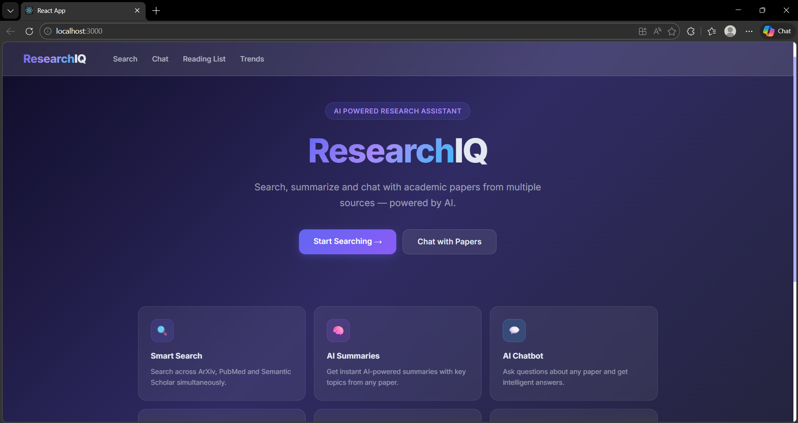
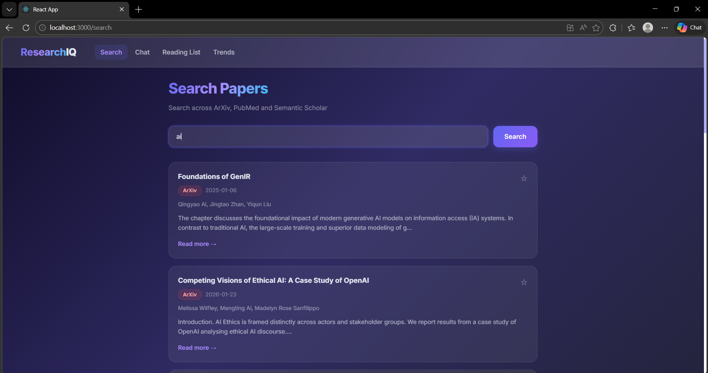
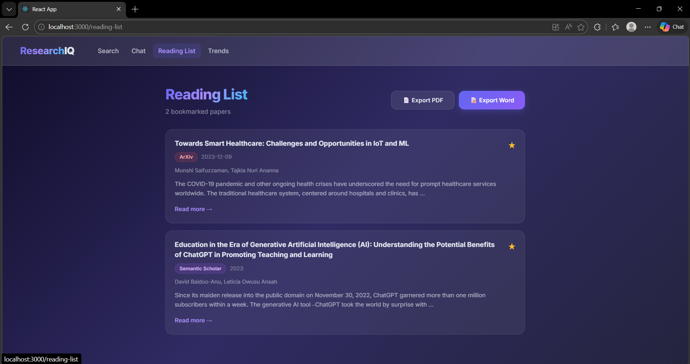
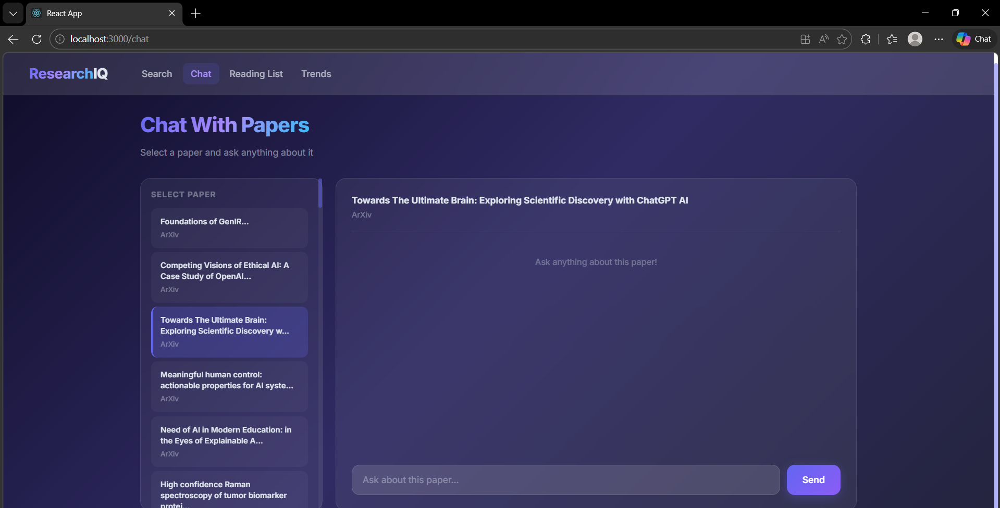
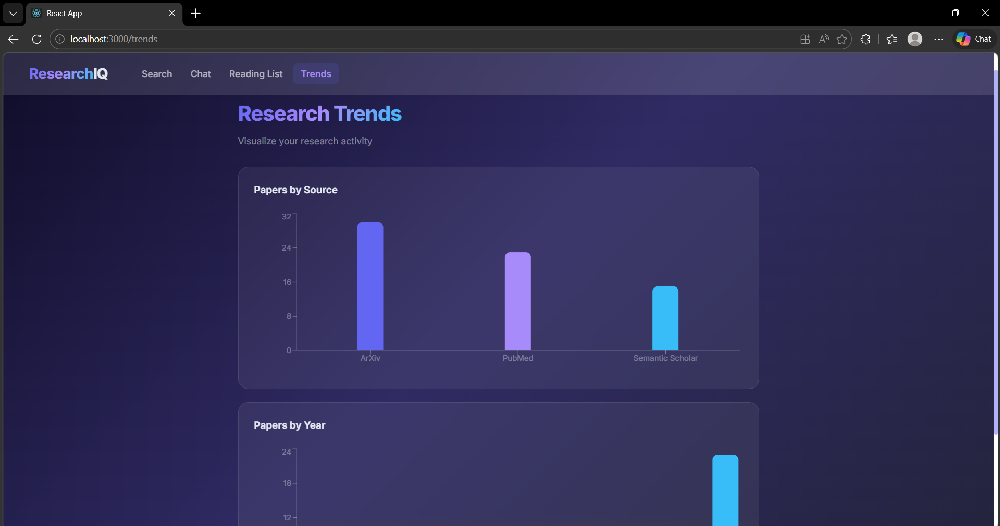
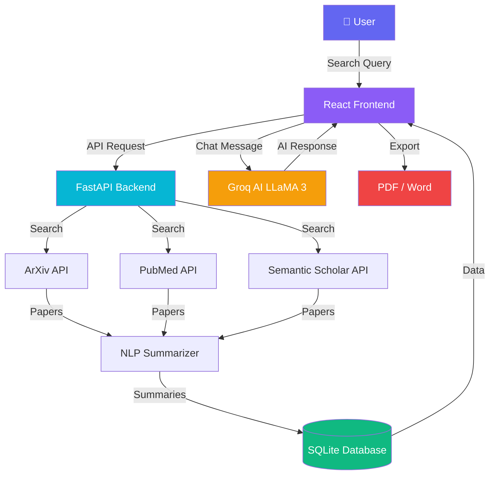

<div align="center">


<br/>

[](https://git.io/typing-svg)

<br/>


<br/>


</div>

---

## 🌟 Overview

> **ResearchIQ** is a full-stack AI-powered research assistant that helps students and researchers search, summarize, and interact with academic papers — all in one beautiful interface.

<div align="center">

### 🏠 Home Page


</div>

---

## ✨ Features

<div align="center">

| Feature | Description | Status |
|---------|-------------|--------|
| 🔍 Smart Search | Search ArXiv, PubMed & Semantic Scholar | ✅ Live |
| 🧠 AI Summaries | NLP-powered summaries + keywords | ✅ Live |
| 💬 AI Chatbot | Chat with papers using Groq LLaMA 3 | ✅ Live |
| 🔗 Citation Tracker | Track references & citations | ✅ Live |
| 📚 Reading List | Bookmark & organize papers | ✅ Live |
| 📄 Export | PDF & Word export | ✅ Live |
| 📈 Trend Charts | Visualize research trends | ✅ Live |
| 🎨 Modern UI | Glassmorphism + gradient design | ✅ Live |

</div>

---

## 📸 Screenshots

<div align="center">

### 🔍 Search Papers


### 📄 Paper Details & AI Summary


### 💬 AI Chat Interface


### 📈 Research Trends


</div>

---

## 📊 Project Stats

<div align="center">
```
╔═══════════════════════════════════════════════════════════╗
║                    ResearchIQ Stats                       ║
╠═══════════════════════════════════════════════════════════╣
║  📦 Search Sources    │  ArXiv + PubMed + Semantic Scholar ║
║  🤖 AI Model          │  Groq LLaMA 3.3 70B               ║
║  🗄️  Database          │  SQLite                           ║
║  ⚡ Backend           │  Python FastAPI                    ║
║  🎨 Frontend          │  React + TailwindCSS               ║
║  📄 Export Formats    │  PDF + Word                        ║
╚═══════════════════════════════════════════════════════════╝
```

</div>

---

## 🏗️ Architecture


---

## 🚀 Getting Started

### Prerequisites
```bash
node --version    # v20+
python --version  # 3.11+
npm --version     # 10+
```

### ⚡ Quick Start

**1️⃣ Clone the repository**
```bash
git clone https://github.com/harshadulshan/ResearchIQ.git
cd ResearchIQ
```

**2️⃣ Setup Backend**
```bash
cd backend
python -m venv venv
venv\Scripts\activate
pip install -r requirements.txt
```

**3️⃣ Add your Groq API key**
```python
# backend/chatbot.py
GROQ_API_KEY = "your-groq-api-key-here"
```
> Get free API key at 👉 https://console.groq.com

**4️⃣ Start Backend**
```bash
uvicorn main:app --reload
```

**5️⃣ Setup & Start Frontend**
```bash
cd frontend
npm install
npm start
```

**6️⃣ Open in browser**
```
http://localhost:3000
```

---

## 📁 Project Structure
```
ResearchIQ/
├── 📂 backend/
│   ├── 🐍 main.py              ← FastAPI server
│   ├── 🔍 scraper.py           ← Paper scraping
│   ├── 🧠 summarizer.py        ← NLP summaries
│   ├── 🗄️  database.py          ← SQLite models
│   ├── 💬 chatbot.py           ← AI chatbot
│   ├── 🔗 citation_tracker.py  ← Citation tracking
│   └── 📄 exporter.py          ← PDF/Word export
│
├── 📂 frontend/
│   └── 📂 src/
│       ├── 📂 pages/
│       │   ├── 🏠 Home.jsx
│       │   ├── 🔍 Search.jsx
│       │   ├── 📄 Paper.jsx
│       │   ├── 📚 ReadingList.jsx
│       │   ├── 📈 Trends.jsx
│       │   └── 💬 Chat.jsx
│       └── 📂 components/
│           ├── 🃏 PaperCard.jsx
│           ├── 💬 ChatBox.jsx
│           └── 📊 Charts.jsx
│
└── 📂 screenshots/
    ├── 🖼️  home.png
    ├── 🖼️  search.png
    ├── 🖼️  paper.png
    ├── 🖼️  chat.png
    └── 🖼️  trends.png
```

---

## 🛠️ Tech Stack

<div align="center">

| Layer | Technology | Purpose |
|-------|-----------|---------|
| 🎨 Frontend | React 18 | UI Framework |
| 💅 Styling | TailwindCSS | Glassmorphism UI |
| 📊 Charts | Recharts | Data Visualization |
| ⚡ Backend | Python FastAPI | REST API |
| 🗄️ Database | SQLite + SQLAlchemy | Data Storage |
| 🤖 AI | Groq LLaMA 3.3 70B | Chatbot |
| 🔍 Search | ArXiv + PubMed + Semantic Scholar | Paper Sources |
| 📄 Export | ReportLab + python-docx | PDF & Word |

</div>

---

## 👨‍💻 Author

<div align="center">

**Harsha Dulshan**

[](https://github.com/harshadulshan)

*Built with ❤️ for university project*

</div>

---

## 📄 License

<div align="center">

This project is licensed under the **MIT License** — see the [LICENSE](LICENSE) file for details.


</div>
